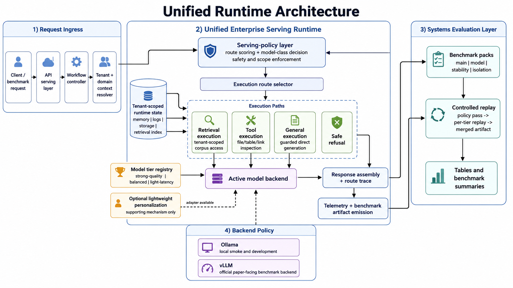

# Adaptive Orchestration for Multi-Domain, Multi-Tenant Enterprise LLM Serving


This repository is a curated research artifact for a systems-and-application study on adaptive enterprise LLM orchestration.

The project studies how a shared enterprise LLM runtime can route requests across retrieval, tool use, direct generation, and explicit safe refusal under multi-domain and multi-tenant constraints. Its focus is not only whether the final answer is correct, but whether the runtime decision process can be made observable, auditable, and evaluable through route-level evidence.

<p align="center">
  
</p>

## At a Glance

| Aspect               | Description                                                     |
| -------------------- | --------------------------------------------------------------- |
| Research type        | Systems-and-application study                                   |
| Runtime scope        | Multi-domain, multi-tenant enterprise LLM serving               |
| Main object of study | Serving-policy behavior and route-level evidence                |
| Execution paths      | `retrieval`, `tool`, `general`, `out_of_scope`                  |
| Evaluation mode      | Benchmark construction, route evaluation, and controlled replay |
| Development backend  | `Ollama` for local smoke checks                                 |
| Paper-facing backend | `vLLM` for full benchmark execution                             |
| Current status       | Runnable prototype; final benchmark runs still in progress      |

## Paper-Facing Scope

The current paper-facing scope is:

* multi-domain, multi-tenant enterprise serving
* adaptive execution-path selection across `retrieval`, `tool`, `general`, and `out_of_scope`
* controlled model-tier evaluation on the `Qwen3-AWQ` ladder
* tenant-aware runtime boundaries and route-level evidence
* reproducible benchmark construction for cross-domain evaluation

The central claim is not that orchestration is novel by itself. The central claim is that, in a shared enterprise setting, the serving-policy layer is itself part of the evaluation object: it determines which path handles a request, what evidence is exposed, when fallback behavior is triggered, and whether tenant boundaries are preserved.

## What This Repository Does Not Claim

The repo does **not** claim:

* a new foundation model
* a new retrieval algorithm
* a new learned router
* online concurrent multi-model serving as the main evidence
* production readiness as an enterprise deployment platform
* a completed benchmark package for all intended comparison rows

For joint `path + model-tier` evaluation, the policy decision is recorded once and executed through controlled replay on the same backend and hardware.

## Current Status

What is implemented:

* FastAPI-based serving runtime in `enterprise_runtime/`
* heuristic path router with route telemetry
* tenant-aware retrieval, file/tool path, memory, and runtime metadata
* structured multi-domain benchmark corpus with 6 tenants across 3 domains
* benchmark builders, validators, isolation pack, and controlled replay pipeline

What is validated:

* source query-pack construction from the current tenant corpora
* balanced benchmark-pack construction
* strict semantic validation for main/model/stability/isolation packs
* controlled replay data preparation for joint `path + model-tier` evaluation

What is still in progress:

* paper-facing full benchmark execution on `vLLM`
* retrieval/source prompts and routing behavior hardening across benchmark cases
* final benchmark tables backed by clean end-to-end runs

This is best read as a runnable prototype with a validated benchmark construction pipeline, not as a benchmark-complete artifact.

## Repository Layout

* `enterprise_runtime/`: serving runtime, router, workflow, retrieval, tools, API
* `systems_evaluation/`: benchmark preparation, validation, execution, replay, reporting
* `data/tenants/`: tenant-scoped corpora for the benchmark packs
* `config/tenants.json`: tenant/domain metadata
* `docs/`: research framing, setup, validation, limitations, figures, and public-facing status

Supporting personalization code remains in the repo as a secondary layer, not the core contribution.

## Recommended Reading

Start here:

1. [docs/README.md](docs/README.md)
2. [docs/01_source_of_truth/RESEARCH_FOCUS.md](docs/01_source_of_truth/RESEARCH_FOCUS.md)
3. [docs/02_active_guides/EXTERNAL_REPO_STATUS.md](docs/02_active_guides/EXTERNAL_REPO_STATUS.md)
4. [docs/02_active_guides/SETUP_AND_DEV_GUIDE.md](docs/02_active_guides/SETUP_AND_DEV_GUIDE.md)
5. [docs/02_active_guides/BENCHMARK_LIMITATIONS.md](docs/02_active_guides/BENCHMARK_LIMITATIONS.md)

Design figures exported for proposal and paper use are stored under `docs/figures/`.

## Quick Start

Create `.env`:

```bash
cp .env.example .env
```

Build and start the core services:

```bash
make bootstrap
make ps
```

Open a shell in the dev container:

```bash
make dev-shell
```

## Benchmark Workflow

Build or audit the benchmark corpora:

```bash
make build-benchmark-corpus
make audit-benchmark-corpus
```

Prepare and validate the paper-facing benchmark packs:

```bash
make prepare-benchmark-pack
make validate-benchmark-pack
make validate-benchmark-content
make check-benchmark-readiness
```

Run paper-facing benchmark stages:

```bash
make benchmark-route-policy
make benchmark-end-to-end
make benchmark-joint-replay
make benchmark-model-sensitivity
make benchmark-stability
make benchmark-isolation
```

Build tables from completed runs:

```bash
make build-main-table
make build-model-sensitivity-table
make build-stability-table
make build-isolation-table
```

## Backend Policy

* `Ollama`: local development and smoke checks
* `vLLM`: official benchmark backend for paper-facing runs

The intended model ladder is:

* `Qwen3-14B-AWQ` as `strong-quality`
* `Qwen3-8B-AWQ` as `balanced`
* `Qwen3-4B-AWQ` as `light-latency`

The repository currently assumes:

* route-only policy passes may use `--model-class adaptive`
* end-to-end adaptive model-tier execution must go through controlled replay

## Public-Facing Claim Discipline

If you are reading this repository externally, the safe summary is:

> This project implements a tenant-aware enterprise LLM runtime and a validated multi-domain benchmark-construction pipeline for studying adaptive orchestration. The codebase already supports route-level evaluation and controlled replay for joint path-and-model policy analysis, while the final paper-facing benchmark runs remain an active execution task.
