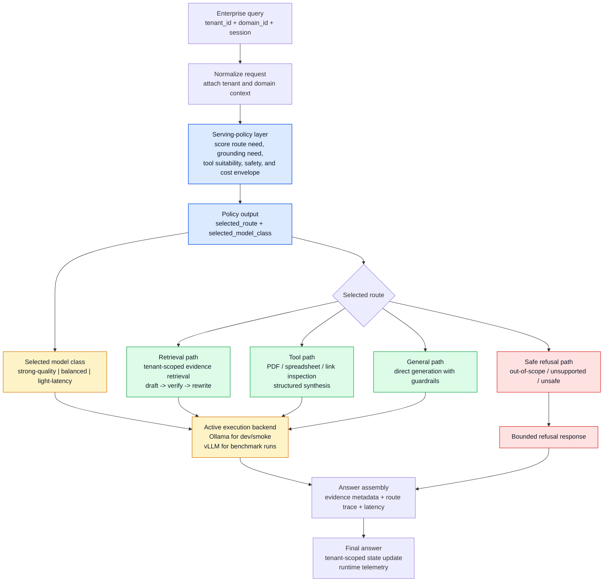
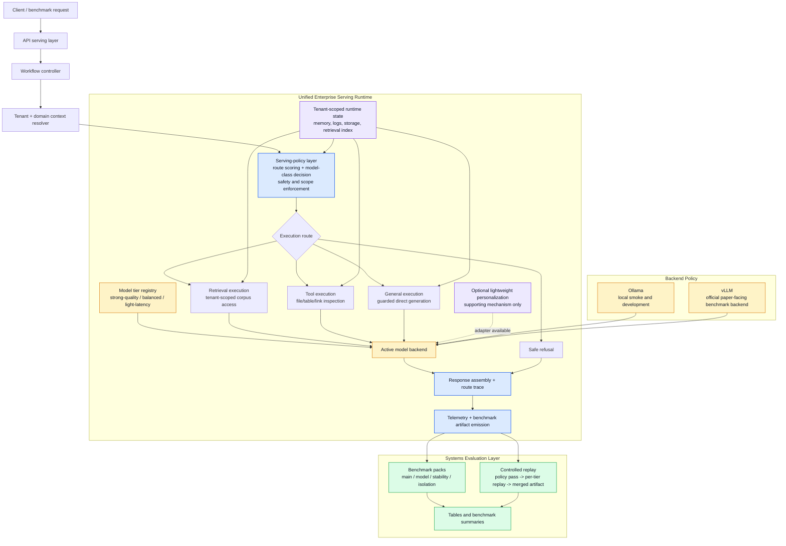
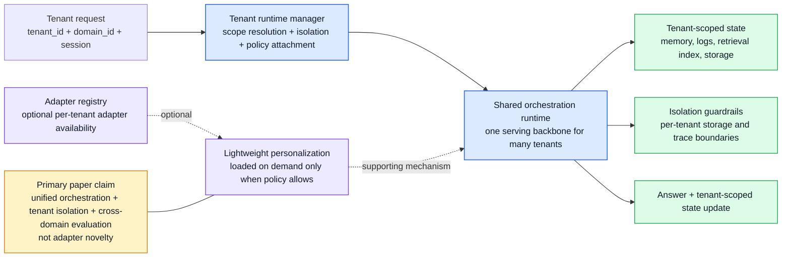
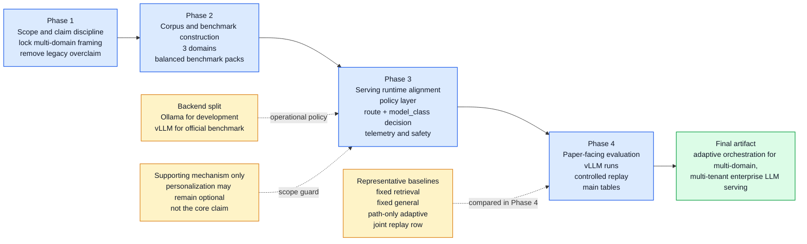

# Framework Diagrams

This file replaces the older framework figures that still reflected the earlier
`adaptive multi-path` framing. The diagrams below are aligned with the current
proposal-facing direction:

- multi-domain, multi-tenant enterprise LLM serving
- explicit `serving-policy layer`
- adaptive choice of `route + model_class`
- `Ollama` for development and smoke only
- `vLLM` for paper-facing benchmark runs
- controlled replay for joint `path + model-tier` evaluation

PlantUML export-oriented versions for the two densest diagrams are available at:

- [plantuml/unified_runtime_architecture.puml](plantuml/unified_runtime_architecture.puml)
- [plantuml/benchmark_controlled_replay_pipeline.puml](plantuml/benchmark_controlled_replay_pipeline.puml)

## 1. Adaptive Orchestration Runtime Workflow

## 2. Unified Runtime Architecture

## 3. Benchmark And Controlled Replay Pipeline

```mermaid
flowchart LR
    A["Benchmark corpora<br/>3 domains<br/>2 content-bearing tenants per domain"] --> B["Source query-pack construction"]
    B --> C["Balanced benchmark construction<br/>main / model / stability / isolation"]
    C --> D["Pack validation<br/>structure + semantics + readiness"]

    D --> E["Online policy pass<br/>route decision + selected_model_class + trace"]
    E --> F["Paper-facing benchmark rows<br/>fixed routes / adaptive path-only"]
    E --> G["Controlled replay branch<br/>replay same cases across model tiers"]

    G --> H["Per-tier replay artifacts<br/>14B / 8B / 4B under one backend policy"]
    H --> I["Merged joint artifact<br/>path + model-tier evaluation"]

    F --> J["Main comparison tables"]
    I --> J
    J --> K["Claim-safe reporting<br/>no overclaim of live concurrent multi-model serving"]

    classDef data fill:#dbeafe,stroke:#2563eb,stroke-width:1.3px,color:#111827;
    classDef eval fill:#dcfce7,stroke:#16a34a,stroke-width:1.3px,color:#111827;
    classDef caution fill:#fee2e2,stroke:#dc2626,stroke-width:1.3px,color:#111827;

    class A,B,C,D data;
    class E,F,G,H,I,J eval;
    class K caution;
```

## 4. Tenant Runtime And Supporting Personalization

## 5. Proposal-Facing Roadmap

